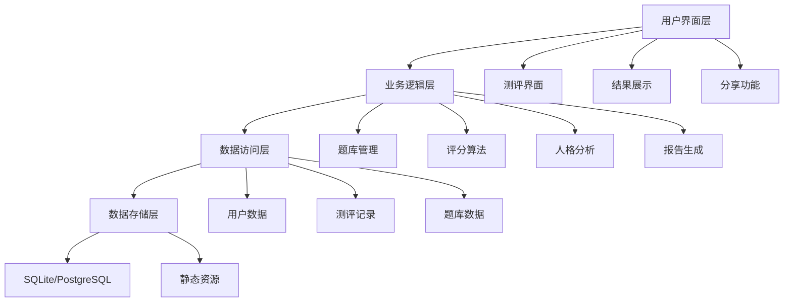

# 街舞舞者人格测评系统设计文档

## 概述

街舞舞者人格测评系统是一个基于现代心理学理论与街舞文化深度融合的Web应用程序。系统通过科学的测评方法，为街舞舞者提供个性化的人格分析，帮助他们更好地理解自己的舞蹈风格、团队角色和发展潜力。

## 理论基础

### 心理学理论框架

**大五人格理论 (Big Five/OCEAN)**
- **开放性 (Openness)**: 对新体验的开放程度，映射到街舞的创新能力和风格探索
- **尽责性 (Conscientiousness)**: 自律和目标导向，对应练习态度和技巧精进
- **外向性 (Extraversion)**: 社交能力和能量表达，关联Battle表现和舞台魅力
- **宜人性 (Agreeableness)**: 合作和同理心，体现在团队协作和Cypher互动
- **神经质 (Neuroticism)**: 情绪稳定性，影响压力下的表现和适应能力

**心流理论 (Flow Theory)**
- 专注状态下的最佳体验，特别适用于街舞的即兴创作和Battle状态
- 挑战与技能的平衡，指导舞者找到适合的发展路径

**社会认同理论**
- 群体归属感和角色定位，帮助理解舞者在街舞社区中的位置
- 内群体偏好和外群体态度，分析不同舞种间的互动模式

### 街舞文化维度

**表现维度**
- Battle竞争性：在对战中的表现欲和竞争心态
- Cypher参与度：在即兴舞蹈圈中的活跃程度和互动方式
- 舞台表现力：面对观众时的自信度和感染力

**学习维度**
- 技巧导向vs风格导向：偏重技术精进还是个人风格发展
- 模仿学习vs原创探索：学习新动作的偏好方式
- 传统保持vs创新突破：对街舞传统文化的态度

**社交维度**
- 领导倾向：在团队中承担领导角色的意愿
- 协作偏好：与他人合作的方式和程度
- 文化传播：向新人传授街舞文化的热情

## 系统架构

### 整体架构图



### 技术栈选择

**前端技术**
- **框架**: React 18 + TypeScript
- **状态管理**: Zustand (轻量级状态管理)
- **UI组件**: Tailwind CSS + Framer Motion (动画效果)
- **图表库**: Chart.js (雷达图展示)
- **构建工具**: Vite

**后端技术**
- **运行时**: Node.js + Express
- **数据库**: PostgreSQL (生产) / SQLite (开发)
- **ORM**: Prisma
- **身份验证**: JWT
- **文件存储**: 本地存储 + CDN

**部署方案**
- **容器化**: Docker
- **部署平台**: Vercel/Netlify (前端) + Railway/Render (后端)

## 核心组件设计

### 1. 题库系统

**题目结构设计**
```typescript
interface Question {
  id: string;
  content: string;
  category: QuestionCategory;
  dimension: PersonalityDimension;
  isReverse: boolean; // 反向计分
  danceStyles: DanceStyle[]; // 相关舞种
  scenario: ScenarioType; // 场景类型
}

enum QuestionCategory {
  BATTLE_PERFORMANCE = 'battle_performance',
  CYPHER_INTERACTION = 'cypher_interaction', 
  MUSIC_SENSITIVITY = 'music_sensitivity',
  LEARNING_STYLE = 'learning_style',
  TEAM_COLLABORATION = 'team_collaboration',
  CREATIVE_EXPRESSION = 'creative_expression'
}

enum PersonalityDimension {
  OPENNESS = 'openness',
  CONSCIENTIOUSNESS = 'conscientiousness', 
  EXTRAVERSION = 'extraversion',
  AGREEABLENESS = 'agreeableness',
  NEUROTICISM = 'neuroticism'
}
```

**题目分布策略**
- 每个维度12-13道题目，确保平衡覆盖
- 30%正向计分，70%包含反向计分题目
- 场景分布：Cypher 25%，Battle 20%，练习 20%，表演 15%，学习 20%

### 2. 人格分析引擎

**12种人格类型定义**

```typescript
interface PersonalityType {
  id: string;
  name: string;
  nickname: string;
  description: string;
  characteristics: string[];
  strengths: string[];
  recommendedStyles: DanceStyle[];
  developmentSuggestions: string[];
  avatarUrl: string;
  colorScheme: ColorScheme;
}

const personalityTypes: PersonalityType[] = [
  {
    id: 'code_player',
    name: '暗号玩家',
    nickname: 'The Code Breaker',
    description: '善于解读音乐中的隐藏节拍和情感密码，用身体语言诠释复杂的音乐结构',
    characteristics: ['音乐敏感度极高', '善于发现细节', '喜欢挑战复杂节拍'],
    strengths: ['节拍感强', '创意独特', '技术精湛'],
    recommendedStyles: ['POPPING', 'LOCKING', 'ANIMATION'],
    developmentSuggestions: ['尝试更多音乐风格', '参与更多即兴创作', '分享技巧心得']
  },
  // ... 其他11种类型
];
```

**评分算法设计**
```typescript
interface ScoreCalculation {
  calculateDimensionScores(answers: Answer[]): DimensionScores;
  determinePersonalityType(scores: DimensionScores): PersonalityType;
  generatePersonalityProfile(type: PersonalityType, scores: DimensionScores): PersonalityProfile;
}

// 使用加权平均和标准化处理
function calculatePersonalityMatch(scores: DimensionScores): PersonalityTypeMatch[] {
  return personalityTypes.map(type => ({
    type,
    matchScore: calculateWeightedMatch(scores, type.dimensionWeights),
    confidence: calculateConfidence(scores, type)
  })).sort((a, b) => b.matchScore - a.matchScore);
}
```

### 3. 用户界面设计

**设计系统**
```typescript
// 色彩方案
const colorScheme = {
  primary: {
    orange: '#FF6B35',    // 主橙色
    blue: '#004E89',      // 深蓝色
    cyan: '#1A8FE3',      // 青色
  },
  secondary: {
    yellow: '#FFD23F',    // 黄色
    green: '#06FFA5',     // 荧光绿
    red: '#FF3366',       // 红色
  },
  neutral: {
    dark: '#1A1A1A',     // 深灰
    medium: '#404040',    // 中灰
    light: '#F5F5F5',    // 浅灰
  }
};

// 街头风格组件
const streetStyleComponents = {
  GraffitiButton: '涂鸦风格按钮',
  NeonText: '霓虹灯文字效果',
  BreakdanceLoader: '街舞动作加载动画',
  CypherProgress: '圆圈进度指示器',
  BattleCard: '对战卡片样式'
};
```

**响应式布局**
- 移动优先设计，确保手机端体验
- 断点设置：sm(640px), md(768px), lg(1024px), xl(1280px)
- 关键交互元素适配触摸操作

### 4. 数据模型设计

**数据库模式**
```sql
-- 用户表
CREATE TABLE users (
  id UUID PRIMARY KEY,
  username VARCHAR(50) UNIQUE,
  email VARCHAR(100) UNIQUE,
  created_at TIMESTAMP DEFAULT NOW(),
  updated_at TIMESTAMP DEFAULT NOW()
);

-- 测评记录表
CREATE TABLE assessments (
  id UUID PRIMARY KEY,
  user_id UUID REFERENCES users(id),
  personality_type VARCHAR(50),
  dimension_scores JSONB,
  completed_at TIMESTAMP DEFAULT NOW(),
  is_shared BOOLEAN DEFAULT FALSE
);

-- 题目表
CREATE TABLE questions (
  id UUID PRIMARY KEY,
  content TEXT NOT NULL,
  category VARCHAR(50),
  dimension VARCHAR(50),
  is_reverse BOOLEAN DEFAULT FALSE,
  dance_styles TEXT[],
  scenario_type VARCHAR(50),
  order_index INTEGER
);

-- 答案表
CREATE TABLE answers (
  id UUID PRIMARY KEY,
  assessment_id UUID REFERENCES assessments(id),
  question_id UUID REFERENCES questions(id),
  score INTEGER CHECK (score >= 1 AND score <= 5),
  answered_at TIMESTAMP DEFAULT NOW()
);
```

## 错误处理

### 前端错误处理
```typescript
// 全局错误边界
class AssessmentErrorBoundary extends React.Component {
  handleError(error: Error, errorInfo: ErrorInfo) {
    // 记录错误日志
    console.error('Assessment Error:', error, errorInfo);
    
    // 显示友好错误信息
    this.setState({
      hasError: true,
      errorMessage: '测评过程中出现了问题，请刷新页面重试'
    });
  }
}

// API错误处理
const handleApiError = (error: AxiosError) => {
  if (error.response?.status === 429) {
    return '请求过于频繁，请稍后再试';
  } else if (error.response?.status >= 500) {
    return '服务器暂时不可用，请稍后重试';
  } else {
    return '网络连接异常，请检查网络设置';
  }
};
```

### 后端错误处理
```typescript
// 全局错误中间件
app.use((error: Error, req: Request, res: Response, next: NextFunction) => {
  logger.error('Server Error:', error);
  
  if (error instanceof ValidationError) {
    return res.status(400).json({
      error: 'VALIDATION_ERROR',
      message: '输入数据格式不正确'
    });
  }
  
  if (error instanceof DatabaseError) {
    return res.status(500).json({
      error: 'DATABASE_ERROR', 
      message: '数据处理异常，请稍后重试'
    });
  }
  
  res.status(500).json({
    error: 'INTERNAL_ERROR',
    message: '服务器内部错误'
  });
});
```

## 测试策略

### 单元测试
- **前端**: Jest + React Testing Library
- **后端**: Jest + Supertest
- **覆盖率目标**: 80%以上

### 集成测试
- API端点测试
- 数据库操作测试
- 第三方服务集成测试

### 端到端测试
- **工具**: Playwright
- **测试场景**: 
  - 完整测评流程
  - 结果展示和分享
  - 错误恢复机制

### 性能测试
- 页面加载时间 < 3秒
- API响应时间 < 500ms
- 并发用户支持 > 100人

## 安全考虑

### 数据安全
- 用户数据加密存储
- HTTPS强制使用
- SQL注入防护
- XSS攻击防护

### 隐私保护
- 最小化数据收集
- 用户数据匿名化选项
- 符合GDPR要求
- 清晰的隐私政策

### 访问控制
- JWT token认证
- 请求频率限制
- 敏感操作二次确认

## 部署架构

### 开发环境
```yaml
# docker-compose.dev.yml
version: '3.8'
services:
  frontend:
    build: ./frontend
    ports:
      - "3000:3000"
    volumes:
      - ./frontend:/app
    
  backend:
    build: ./backend
    ports:
      - "8000:8000"
    environment:
      - NODE_ENV=development
      - DATABASE_URL=postgresql://user:pass@db:5432/streetdance_dev
    
  database:
    image: postgres:15
    environment:
      - POSTGRES_DB=streetdance_dev
      - POSTGRES_USER=user
      - POSTGRES_PASSWORD=pass
```

### 生产环境
- **前端**: Vercel自动部署
- **后端**: Railway/Render容器部署
- **数据库**: PostgreSQL托管服务
- **CDN**: Cloudflare静态资源加速
- **监控**: Sentry错误追踪 + Google Analytics

## 性能优化

### 前端优化
- 代码分割和懒加载
- 图片压缩和WebP格式
- Service Worker缓存策略
- 虚拟滚动长列表

### 后端优化
- 数据库查询优化
- Redis缓存热点数据
- API响应压缩
- 连接池管理

### 用户体验优化
- 骨架屏加载状态
- 渐进式图片加载
- 离线功能支持
- 预加载关键资源